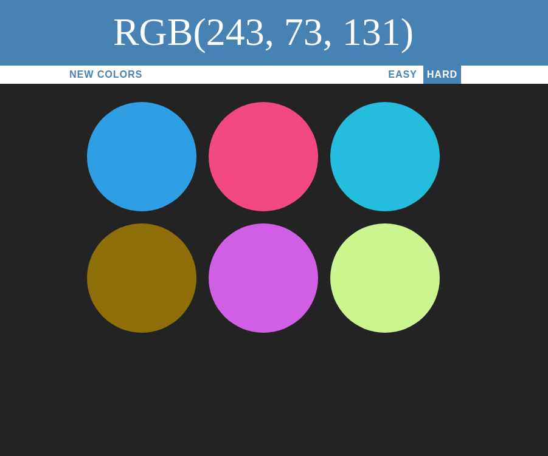

# RGB-ColorGame
Given a randomly generated RGB code can you choose which of the possibilities are the correct displayed RGB code?

**Link to project:** http://recruiters-love-seeing-live-demos.com/

## How It's Made:

**Tech used:** HTML, CSS, JavaScript

Using six divs in the HTML page I coded a few features in JavaScript that would allow the user to change the difficulty of the game by removing 3 of the 6 starting divs.
I built a function that was going to be responsible for generating the colors by utilizing the Math object and generating 3 rangom integers from 0 to 255 that represent 
the range of the RGB values. Upon having generated one color the next step was to iterate over the 6 divs and apply a randomly generated color each of their backgroung color styles. Then the color that is displayed at the top of the app would be and the midst of the others that are generated. Choosing the wrong color results in it being eliminated from the choices by setting its display to none. Chooshing the correct color sets all of the squares as well as the header to that color.

## Lessons Learned:

Creating detailed and easily readable functions that have very straight forward behaviour even if that means having to call multiple functions within eachother at times.
Short detailed commenting that allows a reader to easily understand what is happening in a very short read through.

